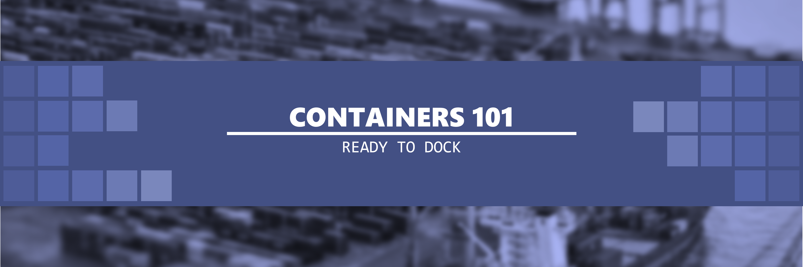

# Containers 101 - Ready to Dock

Remember, this course is just your start and there is no end to learning it!

## Learning Journey

It may take you multiple times to go through any particular Topic/Video/Concept and there is no shame in it. Anyone who says they got the concept in the first try are either really smart or lying, rest of us need repetition and practice to learn anything new.

Also remember, as a beginner there is no such thing as silly questions, so be sure to ask whatever you think is a genuine question.

## Topics Covered

Following is the list of topics covered, they are listed in no specific order and are to just give you an idea of topic we would be learning in this tutorial. The leanring path is split up into 4 main topics/frameworks for using containters.

1. Docker
2. Kubernetes
3. OpenShift
4. Podman
