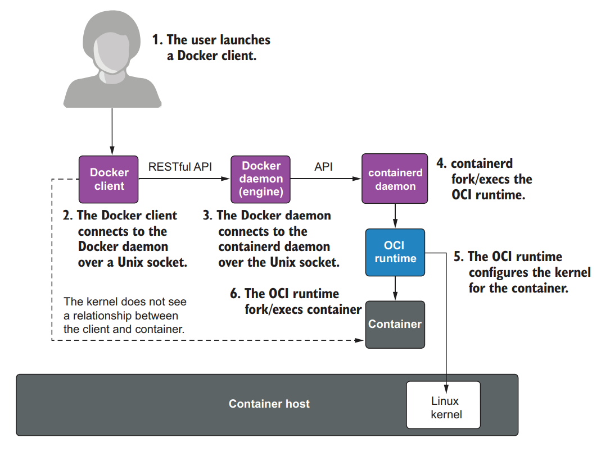

# I Foundations - Podman: A next-generation container engine

> Topics:
>
> - What Podman is
> - The Advantage of using Podman over Docker
> - Examples of using Podman

## Why use Podman when you have Docker

Well one reason is that open source is all about choice. Operating systems have more than one editor, more than one shell, more than one filesystem, and more than one internet web browser.

The following paragraphs list some of Podman's most notable features compared to Docker.

### Rootless containers

In many situations, you do not want to give full root access to your users, but users and developers still need to run containers and build container images.

Podman, on the other hand, can run containers with no additional security features in Linux other than a standard login account. With Podman the processes running on the system are always owned by the user and have no capabilities greater than a normal user. Even if you break out of the container, the process is still running as your UID, and all actions on the system are recorded in the audit logs. Users of Podman cannot simply remove the container and cover up their tracks.

> Note: Docker now has the ability to run rootless but this feature is not yet adopted by the general community.

### Fork/exec model

Unix and C were designed with the fork/exec model of computing. Basically, when you execute a new program, a parent program like the Bash shell forks a new process and then executes the new program as a child of the old program.

| Docker client-server architecture                                 | Podman fork/exec architecture                                 |
|-------------------------------------------------------------------|---------------------------------------------------------------|
|  |  |

### Daemonless

Podman can run all of the same container images as Docker and launch containers with the same container runtimes. However, Podman does this without having multiple continuously root-running daemons.

Your container will continue to run without the overhead of running the multiple daemons. Less overhead is incredibly popular on low-end machines like IOT devices and edge servers.

### User-friendly command line

`alias Docher = Podman`: With this command, you can continue to type in your Docker commands, but Podman runs your containers. If the Podman command line differs from Docker, it is considered a bug in Podman, and users demand Podman to be fixed to make the tools match. The alias means when you type `docker ps`, the `podman ps` command runs.

Many distributions supply a package called podman-docker, which changes the alias from docker to podman and links the man page.

> Note: There are a few commands, such as Docker Swarm, that Podman doesn't support, but for the most part, Podman is a complete replacement for the Docker CLI.

### Support for REST-API

Podman can be run as a socket-activated REST API service. This allows remote clients to manage and launch Podman containers. Podman supports the Docker API as well as the Podman API for advanced Podman features.

### Integration with `systemd`

Podman wants to fully integrate the running of containers with the init system. Users want to use `systemd` to start and stop containers at boot time. Containers should do the following:

- Support `systemd` within a container
- Support socket activation
- Support `systemd` notifications that a containerized application is fully activated
- Allow `systemd` to fully manage the cgroups and lifespan of a containerized application

> Note: The upstream Docker community believes the Docker daemon, as opposed to systemd, should be the controller of processes, it should manage the life cycle of containers, and it should start and stop them at boot time.

### Pods

A pod is a group of one or more containers, with shared storage/network resources, and a specification for how to run the containers. Pods allow you to group multiple services together to form a larger service managed as a single entity.

- Podman works with either a single container at a time, like Docker
- Podman can manage groups of containers together in a pod

### Cusomizable registries

Podman was designed to allow you to specify multiple registries, like what you can do with dnf, yum, and apt tools for installing packages. Podman presents you with a list of registries to choose from, once you make your decision, Podman records the short-name alias and no longer prompts and uses the previously selected registry.

### Multiple transports

Podman supports many different container image sources and targets called `transports`.

| Transport | Description |
|-----------|-------------|
| Container Registry | References a container image stored in a remote container image registry  website. Registries store and share container images (e.g., docker.io and quay.io). |
| `oci` | References a container image compliant with `OCI layout` specifications. The manifest and layer tarballs are located in the local directory as individual files. |
| `dir` | References a container image compliant with the `Docker image layout`, similar to the `oci` transport but storing the files using the legacy `docker` format. |
| `docker-archive` | References a container image in a Docker image layout that is packed into a `TAR` archive. |
| `oci-archive` | References a container image compliant with `OCI layout` specifications that is packed into a `TAR` archive. |
| `docker-daemon` | References an image stored in the Docker daemon’s internal storage. |
| `container-storage` | References a container image located in a local storage. Podman defaults to using container storage for local images. |

### Complete customizability

Podman has its built-in defaults but defines three locations for its configuration files to be stored:

- `/usr/share/containers/containers.conf` - Where a distribution can define the changes the distribution likes to use
- `/etc/containers/containers.conf` - Where they can set up system overrides
- `$HOME/.config/containers/containers.conf` - Can be specified only in rootless mode

The configuration files allow you to configure Podman to run the way you want by default. You can even run with more security by default if you choose.

### User namespace support

Podman is fully integrated with the user namespace. Rootless mode relies on user namespaces, which allows for multiple UIDs to be assigned to a user.

## When not to use Podman

Podman is a tool for running container workloads on a single host in either rootless or rootful mode. Higher-level tools
are required if you want to orchestrate running containers on multiple machines (see `Kubernetes`).

A user namespace can be used to isolate containers from each other. Podman makes it simple to launch multiple containers, each with a unique user namespace. The kernel then isolates the processes from host users as well as each other based on UID separation.
